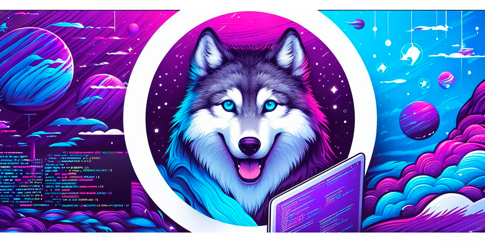

# ¡Bienvenidos a mi mundo en código!                  
 

  
 

 
 
 
 Soy técnico en publicidad, fotógrafo, diseñador gráfico y un entusiasta de la tecnología. Actualmente, estoy incursionando en el mundo del desarrollo de aplicaciones, estudiando Android, Java y Kotlin; áreas que han capturado mi interés y pasión. Mi objetivo es especializarme en ayudar a las personas a transformar sus ideas en realidades.
  

